```mermaid
```mermaid
flowchart LR

%% participants
%% na tę chwilę AMA nie daje nam tego czego chcemy więc nie uwzględniamy jej w MVP
subgraph xsrelease[XsRelease]
    jira[JIRA Change]
    cmdb[Jira CMDB]
    DeplRunner[Deployment Runner]:::api
    ChangeRegistry[Change Registry]:::api
end
ama[AMA]
ralph[RALPH]
vault[HasihCorp Vault]
powerbi[Power BI]
subgraph deptools[Deployment Tools]
    direction RL
    AzurePipelines
    TeamCity
    Jenkins
    ...
end

%% interactions
%% TODO: wyjaśnić jak odbywa się komunikacja ama <-> jira i póki co amy nie zmieniamy. nie robimy endpointa dla amy w change registry na tę chwilę
jira -->|Get AmaReport DoD & test data| ama 
jira -->|GetAssets to fill the form| cmdb
cmdb -->|GetRalphData to fill jira assets| ralph
jira -->|Deploy /Release change| DeplRunner
DeplRunner -->|GetCredentials for deployment| vault
DeplRunner -->|Deploy / Release| deptools
deptools -->|Publish Results| DeplRunner
DeplRunner -->|Publish DeploymentReport| jira
%% publish report for both new chage process or external (custom change processes)
jira -->|Publish ChangeReport| ChangeRegistry
powerbi -->|Get data for reports| ChangeRegistry
%%ama -->|Collect data| ci[CI Tools]
%%ama -->|Collect data| QG[Quality Gate]
%% dsiaptcher w dep tools czy screlease?

%% styling
classDef api stroke:#0f0

```

# README

It is a long established fact that a reader will be distracted by the readable content of a page when looking at its layout. The point of using Lorem Ipsum is that it has a more-or-less normal distribution of letters, as opposed to using 'Content here, content here', making it look like readable English. Many desktop publishing packages and web page editors now use Lorem Ipsum as their default model text, and a search for 'lorem ipsum' will uncover many web sites still in their infancy. Various versions have evolved over the years, sometimes by accident, sometimes on purpose (injected humour and the like).

 

😀

Change History
 

> A history of significant changes or additions to the product. The change reference would typically be a portfolio reference number, or a Service Now ticket number, and the Github tag associated with the change. 

| Date | Description | Change reference |
| ---------- | ---------------- | ------------------------ |
| 29-Sep-22 | Initial Version    | Portfolio 0860                  |

 

Dimensions | Megapixels
---|---
1,920 x 1,080 | 2.1MP
3,264 x 2,448 | 8MP
4,288 x 3,216 | 14MP

<table border="1">
    <thead>
        <tr>
            <th>First Name</th>
            <th>Last Name</th>
            <th>Email</th>
        </tr>
    </thead>
    <tbody>
        <tr>
            <td>John</td>
            <td>Doe</td>
            <td>johndoe@example.com</td>
        </tr>
        <tr>
            <td>Jane</td>
            <td>Smith</td>
            <td>janesmith@example.com</td>
        </tr>
    </tbody>
</table>
