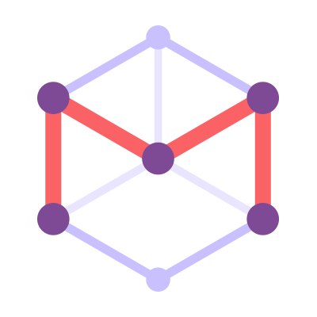

= CHILD

== Examples

.Asciidoctor usage example, should contain 3 lines
[source, ruby]
----
doc = Asciidoctor::Document.new("*This* is it!", :header_footer => false)

puts doc.render
----

// FIXME: use ifdef to show output according to backend
Here's what it outputs (using the built-in templates):

....

  
<strong>This</strong> is it!

....

v_

This verse comes to mind.

[verse]
La la la

Here's another quote:

[quote, Sir Arthur Conan Doyle, The Adventures of Sherlock Holmes]
____
When you have eliminated all which is impossible, then whatever remains, however improbable, must be the truth.
____

Getting Literal [[literally]]
-----------------------------

 Want to get literal? Just prefix a line with a space (just one will do).

....
I'll join that party, too.
....

We forgot to mention in <<numbered>> that you can change the numbering style.

.. first item (yeah!)
.. second item, looking `so mono`
.. third item, +mono+ it is!

// This attribute line will get reattached to the next block
// despite being followed by a trailing blank line
[id='wrapup']

== Wrap-up

NOTE: AsciiDoc is quite cool, you should try it!

[TIP]
.Info
=====
Go to this URL to learn more about it:

* http://asciidoc.org

Or you could return to the xref:first[] or <<purpose,Purpose>>.
=====

Here's a reference to the definition of <<another_term>>, in case you forgot it.

[NOTE]
One more thing. Happy documenting!

[[google]]When all else fails, head over to <http://google.com>.

[tests-diagram]: src/main/resources/images/plugin-logo.png "Diagram of the tests"

== Code ==

:sourcedir: src/main/java/ch/mibex/confluence/include

[source,java]
----
include::src/main/java/ch/mibex/confluence/include/Utils.java[]
----

[source,java]
----
include::{sourcedir}/Utils.java[]
----
== included files ==

include::grandchild.adoc[]
